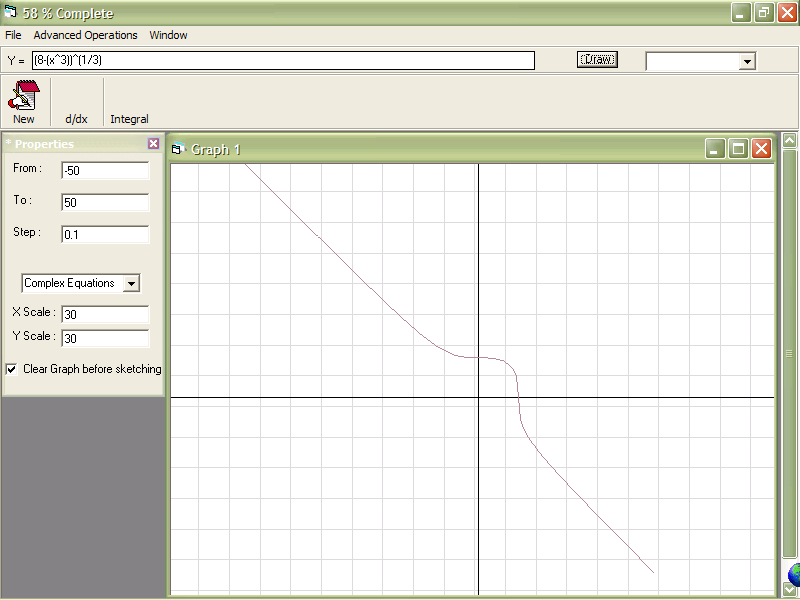



## Function Sketcher

### Description

this function sketcher is really good. if you want to get good results just add () as many as you can. this program supports

[x] greatest interger function

|x| absolute function

almost every trigeometric functions

and lots of functions

Evaluates the derivative, definite integrals, X and Y intercepts.
 
### More Info
 

             |
---                |---
**Submitted On**   |2004-01-01 12:34:02
**By**             |[Haytham Alaa](https://github.com/Planet-Source-Code/PSCIndex/blob/master/ByAuthor/haytham-alaa.md)
**Level**          |Intermediate
**User Rating**    |4.4 (22 globes from 5 users)
**Compatibility**  |VB 6\.0
**Category**       |[Complete Applications](https://github.com/Planet-Source-Code/PSCIndex/blob/master/ByCategory/complete-applications__1-27.md)
**World**          |[Visual Basic](https://github.com/Planet-Source-Code/PSCIndex/blob/master/ByWorld/visual-basic.md)
**Archive File**   |[Function\_S168880112004\.zip](https://github.com/Planet-Source-Code/haytham-alaa-function-sketcher__1-50686/archive/master.zip)

